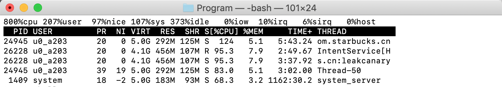
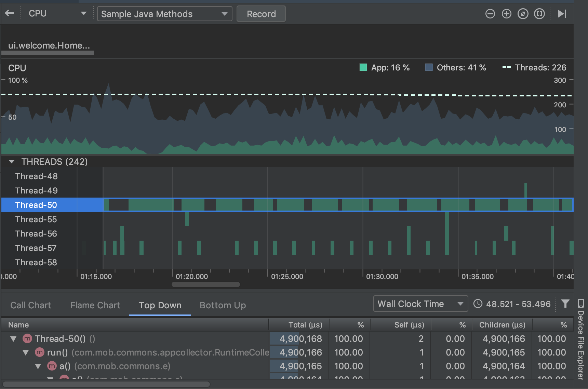

# Android查看CPU占用情况

获取cpu核心数

```
adb shell cat /proc/cpuinfo
```

## 命令

```shell
adb shell top
```

### 参数

使用 `adb shell top --help` 查看所有参数选项

```shell
usage: top [-Hbq] [-k FIELD,] [-o FIELD,] [-s SORT] [-n NUMBER] [-m LINES] [-d SECONDS] [-p PID,] [-u USER,]

Show process activity in real time.

-H	显示具体线程
-k	Fallback sort FIELDS (default -S,-%CPU,-ETIME,-PID)
-o	Show FIELDS (def PID,USER,PR,NI,VIRT,RES,SHR,S,%CPU,%MEM,TIME+,CMDLINE)
-O	Add FIELDS (replacing PR,NI,VIRT,RES,SHR,S from default)
-s	Sort by field number (1-X, default 9)|排序方式
-b	Batch mode (no tty)
-d	Delay SECONDS between each cycle (default 3)|刷新频率,默认为3s
-m	Maximum number of tasks to show|最多显示的任务数量
-n	Exit after NUMBER iterations|刷新次数,达到设置的次数后自动停止
-p	Show these PIDs
-u	Show these USERs
-q	Quiet (no header lines)
```

### 示例

`adb shell top -H`

```shell
  PID USER         PR  NI VIRT  RES  SHR S[%CPU] %MEM     TIME+ THREAD
 6297 shell        20   0  16M 7.3M 1.6M R 33.2   0.1   0:01.00 top            
26817 u0_a287      20   0 4.1G 127M  42M S  4.3   2.2   0:44.78 bucks.cn:remote
  782 root         20   0 2.1G  13M 4.9M S  3.3   0.2  18:09.20 hiview         
  782 root         30  10 2.1G  13M 4.9M S  2.9   0.2  15:06.22 JankIoInfo     
26817 u0_a287      20   0 4.1G 127M  42M S  1.9   2.2   0:27.69 amapLocCoreThre
26817 u0_a287      29   9 4.1G 127M  42M S  1.9   2.2   0:02.11 Profile Saver  
 1229 system       20   0 4.6G 274M 149M S  1.6   4.8 463:19.40 system_server  
```

> PR: Android N之前代表运行在哪个核上，Android N之后表示优先级。
>
> THREAD: 线程名

## 查看线程

如果发现某个线程占用CPU过高，可以使用AndroidStudio的profiler来查看该线程的调用堆栈。



比如上面的一线程Thread-50，它的CPU占用率一直居高不下，那我们进到AndroidStudio里面来看这个线程到底是做什么的。



上面的图中，从右上角可以看出，App的CPU占用率达到了16%，Others其它的所有进程占用了41%，如此看来我们的App的CPU占用率是非常高的。

结前面的Thread-50，从下方的调用堆栈里面，我们已经找到了该线程！！！

查看所有线程的占用情况:

```shell
adb shell top -b -n 1 -H -s 6
```

[参考链接](https://blog.csdn.net/a740169405/article/details/79046211)