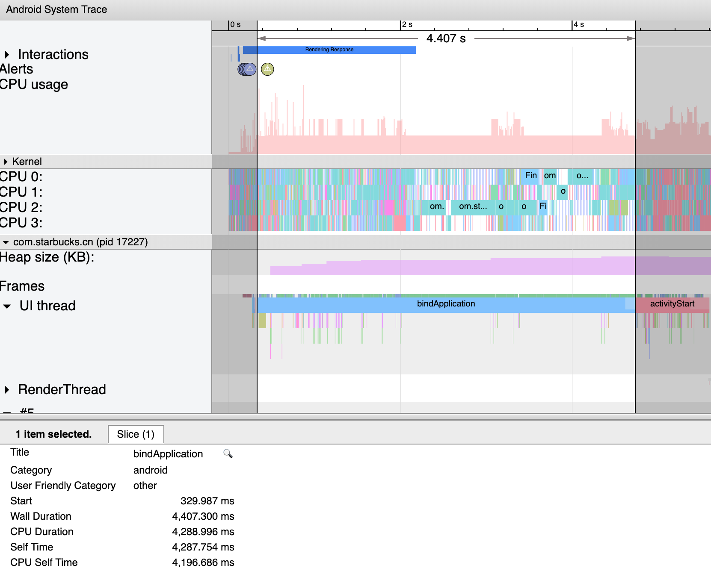
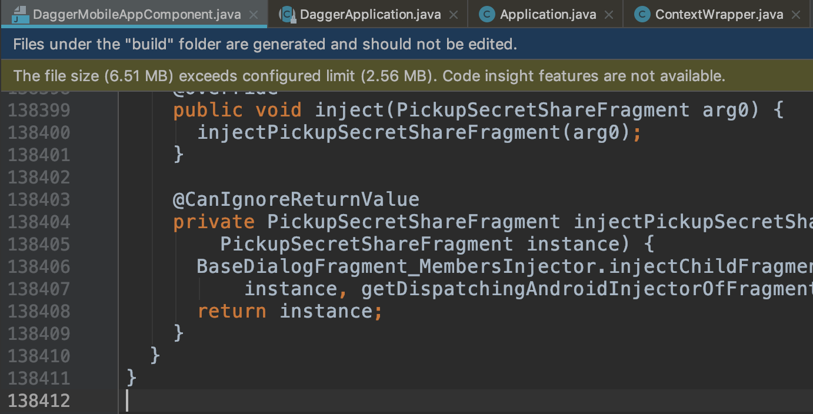
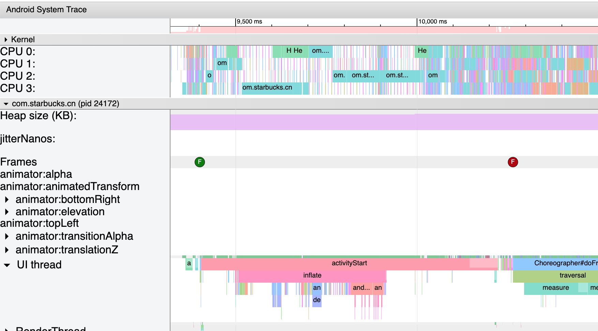
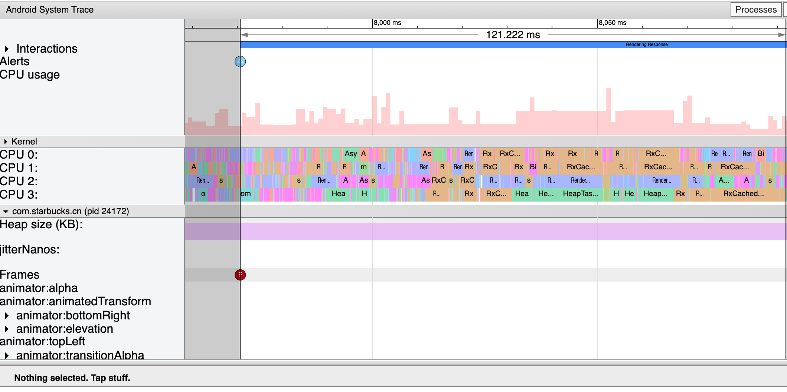
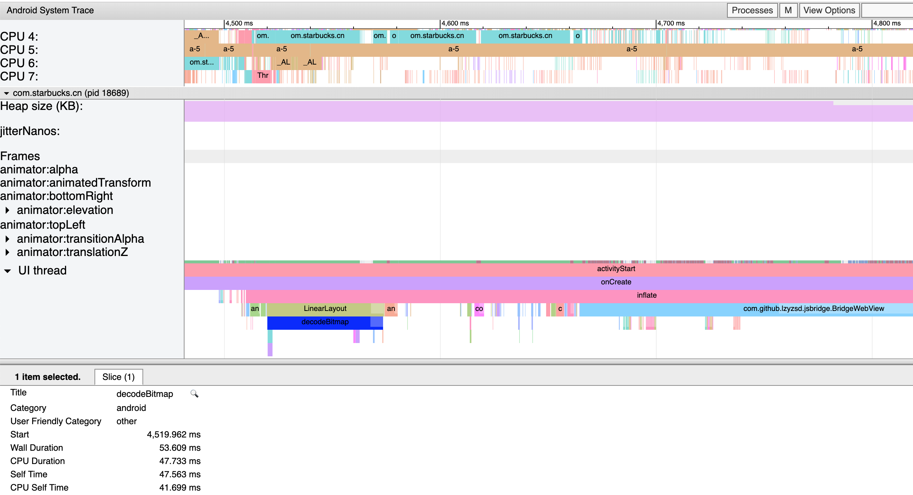

App启动时间优化

## 研究目的

优化App启动时间，提升用户体验。

## 测试设备

1. **ZTE-BA602**: RAM **3G**，CPU **联发科 MT6737**
2. **荣耀Note8**: RAM **4G**，CPU **海思 麒麟 955**

## 现状

在ZTE手机和Note8手机上，分别启动App并抓取日志。

### ZTE

```java
06-25 11:24:57.772  1042  1064 I ActivityManager: Displayed com.starbucks.cn/.ui.LauncherActivity: +7s904ms
06-25 11:25:00.318  1042  1064 I ActivityManager: Displayed com.starbucks.cn/.ui.welcome.HomeActivity: +1s563ms

06-25 11:25:24.359  1042  1064 I ActivityManager: Displayed com.starbucks.cn/.ui.LauncherActivity: +7s952ms
06-25 11:25:26.800  1042  1064 I ActivityManager: Displayed com.starbucks.cn/.ui.welcome.HomeActivity: +1s519ms

06-25 11:28:58.079  1042  1064 I ActivityManager: Displayed com.starbucks.cn/.ui.LauncherActivity: +7s926ms
06-25 11:29:00.741  1042  1064 I ActivityManager: Displayed com.starbucks.cn/.ui.welcome.HomeActivity: +1s621ms
```

LauncherActivity启动时间约**7.9s**，HomeActivity[**未登录**]启动时间约**1.6s**。

### **Note8**

```java
06-29 13:38:06.159   976  1035 I ActivityManager: Displayed com.starbucks.cn/.ui.LauncherActivity: +4s967ms
06-29 13:38:08.689   976  1035 I ActivityManager: Displayed com.starbucks.cn/.ui.welcome.HomeActivity: +1s78ms

06-29 13:38:21.113   976  1035 I ActivityManager: Displayed com.starbucks.cn/.ui.LauncherActivity: +5s124ms
06-29 13:38:23.240   976  1035 I ActivityManager: Displayed com.starbucks.cn/.ui.welcome.HomeActivity: +1s13ms

06-29 13:38:35.584   976  1035 I ActivityManager: Displayed com.starbucks.cn/.ui.LauncherActivity: +4s805ms
06-29 13:38:37.750   976  1035 I ActivityManager: Displayed com.starbucks.cn/.ui.welcome.HomeActivity: +986ms
```

LauncherActivity启动时间约**5s**，HomeActivity[**未登录**]启动时间约**1s**。

> ZTE和Note8手机上，LauncherActivity启动时间都太长，猜测是`Application.onCreate()`做了太多第三方SDK的初始化工作导致的。

## 优化onCreate

将onCreate中的部分不是App一启动时就需要的的功能相关的第三方SDK的初始化工作，提取出来放到一个方法中延迟执行。

```java
private fun lazyInit() {
    if (BuildConfig.DEBUG) {
        if (LeakCanary.isInAnalyzerProcess(this)) {
            return
        }
        LeakCanary.install(this)
    }

    FmPaymentManager.initWX(this, WXPayEnv.WECHAT_PAYMENT_APP_ID)
    FmPaymentManager.FMSDKBuildType(if (BuildConfig.FLAVOR_env == "prod") SDKTYPE.SDK_PRO else SDKTYPE.SDK_DEV)

    // JPush
    JPushInterface.init(this)
    JPushInterface.setDebugMode(BuildConfig.DEBUG) // 设置开启日志,发布时请关闭日志
    d("JPush regId:${JPushInterface.getRegistrationID(this)}")

    //
    if (!BuildConfig.PINNED_HTTP_CLIENT) Stetho.initialize(stethoInitializer)

    SoundUtil.enabled = AppPrefsUtil.isSoundEnabled(this)
    if (SoundUtil.enabled) {
        AppPrefsUtil.setSoundEnabled(this, true)
        SoundUtil.init(this)
    }

    AppPrefsUtil.initUseMaleBarista(this)

    SsoHelper.initSso(this)
    WXShare.instance().init(FmPaymentManager.getWXAPI())

    MigrationUtil.initPreference(this)
    FRMS.instance().startup(this)
    FRMS.instance().setURL(ApiEnv.ATO_URL)
    FRMS.instance().setCustID("ato")

    MiPushClient.getRegId(applicationContext)?.let { id ->
        d("Xiaomi Rid $id")
        skipJPushReceiver = id.isNullOrEmpty().not()
    }

    requestToggle()

    //
    CalligraphyConfig.initDefault(calligraphyConfig)

    initQbSdk()
}
```

在`Application.onCreate`中，延迟执行**lazyInit**方法。

```java
override fun onCreate() {
	// ...
	Observable.timer(10, TimeUnit.SECONDS)
	        .subscribeOn(Schedulers.io())
	        .map {
	            lazyInit()
	            it
	        }
	        .subscribe()
}
```

再次启动App，在ZTE手机和Note8手机上分别启动App并抓取日志。

### ZTE

```java
06-25 11:32:21.232  1042  1064 I ActivityManager: Displayed com.starbucks.cn/.ui.LauncherActivity: +5s600ms
06-25 11:32:23.857  1042  1064 I ActivityManager: Displayed com.starbucks.cn/.ui.welcome.HomeActivity: +1s419ms

06-25 11:32:38.687  1042  1064 I ActivityManager: Displayed com.starbucks.cn/.ui.LauncherActivity: +5s556ms
06-25 11:32:41.336  1042  1064 I ActivityManager: Displayed com.starbucks.cn/.ui.welcome.HomeActivity: +1s376ms

06-25 11:32:54.051  1042  1064 I ActivityManager: Displayed com.starbucks.cn/.ui.LauncherActivity: +5s522ms
06-25 11:32:56.709  1042  1064 I ActivityManager: Displayed com.starbucks.cn/.ui.welcome.HomeActivity: +1s386ms
```

LauncherActivity启动时间约**5.5s**，HomeActivity[**未登录**]启动时间约**1.4s**。

> 优化结果：LauncherActivity启动时间缩短约**2.4s**，整体启动时间缩短**2.5s**。

### Note8

```java
06-29 13:31:47.412   976  1035 I ActivityManager: Displayed com.starbucks.cn/.ui.LauncherActivity: +2s398ms
06-29 13:31:49.778   976  1035 I ActivityManager: Displayed com.starbucks.cn/.ui.welcome.HomeActivity: +1s102ms

06-29 13:32:00.972   976  1035 I ActivityManager: Displayed com.starbucks.cn/.ui.LauncherActivity: +2s507ms
06-29 13:32:03.126   976  1035 I ActivityManager: Displayed com.starbucks.cn/.ui.welcome.HomeActivity: +858ms

06-29 13:32:46.983   976  1035 I ActivityManager: Displayed com.starbucks.cn/.ui.LauncherActivity: +2s335ms
06-29 13:32:49.173   976  1035 I ActivityManager: Displayed com.starbucks.cn/.ui.welcome.HomeActivity: +891ms
```

LauncherActivity启动时间约**2.5s**，HomeActivity[**未登录**]启动时间约**900ms**。

> 优化结果：LauncherActivity启动时间缩短约**2.5s**，整体启动时间缩短**2.5s**。

虽然在两款设备上，启动时间都有大幅度缩短，但是优化后的这个启动时间相比其它App，也是**不忍直视**!!!

## bindApplication

使用systrace工具抓取trace日志，分析启动时间究竟被消耗在什么地方。



上图是**ZTE**手机上，一次启动App时抓取到的trace日志，UI Thread 水平轴上，有一个方法bindApplication执行了很长的一段时间**4.407s**，而我们上面优化后LauncherActivity启动时间约**5.5s**，也就是说大部分时间都被耗在bindApplication这个方法上了。

bindApplication何方神圣，他是在什么地方被执行的？

```java
@GuardedBy("this")
private final boolean attachApplicationLocked(IApplicationThread thread,
        int pid, int callingUid, long startSeq) {

    thread.bindApplication(processName, appInfo, providers, null, profilerInfo,
            null, null, null, testMode,
            mBinderTransactionTrackingEnabled, enableTrackAllocation,
            isRestrictedBackupMode || !normalMode, app.persistent,
            new Configuration(getGlobalConfiguration()), app.compat,
            getCommonServicesLocked(app.isolated),
            mCoreSettingsObserver.getCoreSettingsLocked(),
            buildSerial, isAutofillCompatEnabled);           
}           
```

在Android系统源码ActivityManagerService里面，可以找到它的踪迹，它是在attachApplicationLocked方法中，通过ApplicationThread调用到App进程中的，表示一个应用程序的Application对象在AMS中创建完成。而该方法最终又将调用到Application.onCreate()，但上面已经对onCreate()方法做了优化，难道剩下的那几行代码需要足足**4s+**来执行？看看父类DaggerApplication做了什么工作吧。

```java
  @Override
  public void onCreate() {
    super.onCreate();
    injectIfNecessary();
  }

  /**
   * Implementations should return an {@link AndroidInjector} for the concrete {@link
   * DaggerApplication}. Typically, that injector is a {@link dagger.Component}.
   */
  @ForOverride
  protected abstract AndroidInjector<? extends DaggerApplication> applicationInjector();

	private void injectIfNecessary() {
  	if (needToInject) {
    	synchronized (this) {
      	if (needToInject) {
        	@SuppressWarnings("unchecked")
        	AndroidInjector<DaggerApplication> applicationInjector =
            (AndroidInjector<DaggerApplication>) applicationInjector();
        	applicationInjector.inject(this);
      	}
    	}
  	}
	}
```

DaggerApplication.onCreate()，调用了injectIfNecessary()，该方法是dagger依赖注入框架所使用的。

`applicationInjector()`是一个抽象方法，返回一个`dagger.Component`对象，再回过头来看MobileApp里面该方法的实现。

```java
override fun applicationInjector(): AndroidInjector<out DaggerApplication> {
    mobileAppComponent = DaggerMobileAppComponent.builder().create(this) as MobileAppComponent
    return mobileAppComponent
}
```

它返回了一个DaggerMobileAppComponent，该类是dagger框架自动生成的一个类，查看该类的源码：



该类居然达到了夸张的**138412**行代码。抛开执行里面的方法，jvm将这样一个庞大的class加载进内存，也要耗费不少时间。而`inject(MobileApp)`方法，也执行了很多其它相关组件的inject方法。

```java
  @Override
  public void inject(MobileApp arg0) {
    DaggerApplication_MembersInjector.injectActivityInjector(
        instance, getDispatchingAndroidInjectorOfActivity());
    DaggerApplication_MembersInjector.injectBroadcastReceiverInjector(
        instance, getDispatchingAndroidInjectorOfBroadcastReceiver());
    DaggerApplication_MembersInjector.injectFragmentInjector(
        instance, getDispatchingAndroidInjectorOfFragment());
    DaggerApplication_MembersInjector.injectServiceInjector(
        instance, getDispatchingAndroidInjectorOfService());
    DaggerApplication_MembersInjector.injectContentProviderInjector(
        instance, getDispatchingAndroidInjectorOfContentProvider());
    DaggerApplication_MembersInjector.injectSetInjected(instance);
    MobileApp_MembersInjector.injectFabric(instance, getFabric());
    MobileApp_MembersInjector.injectAnswers(instance, getAnswers());
    MobileApp_MembersInjector.injectGa(instance, getGoogleAnalytics());
    MobileApp_MembersInjector.injectTracker(instance, getTracker());
    MobileApp_MembersInjector.injectExecutor(instance, getAppExecutor());
    MobileApp_MembersInjector.injectEarth(instance, getEarth());
    MobileApp_MembersInjector.injectSentry(instance, getSentryClient());
    MobileApp_MembersInjector.injectCrashlytics(
        instance,
        MobileAppModule_ProvideCrashlyticsFactory.proxyProvideCrashlytics(mobileAppModule));
    MobileApp_MembersInjector.injectCalligraphyConfig(
        instance,
        MobileAppModule_ProvideCalligraphyConfigFactory.proxyProvideCalligraphyConfig(
            mobileAppModule));
    MobileApp_MembersInjector.injectStethoInitializer(instance, getInitializer());
    MobileApp_MembersInjector.injectDefaultRealmConfig(instance, getRealmConfiguration());
    MobileApp_MembersInjector.injectDispatchingAndroidInjector(
        instance, getDispatchingAndroidInjectorOfActivity());
    MobileApp_MembersInjector.injectAppSharedReference(instance, getNamedSecurePreferences());
    MobileApp_MembersInjector.injectMaintenanceManager(
        instance, provideMaintenanceManagerProvider.get());
    MobileApp_MembersInjector.injectThirdPartyLoginManager(
        instance, provideThirdPartyLoginManagerProvider.get());
    return instance;
  }
```

> App启动时间过长，是由Dagger组件导致的，是Dagger本身有这样的问题，还是使用方式不正确？

## inflate

在ZTE手机上，HomeActivity[**未登录**]启动时间**1.5s**，在Note8上，HomeActivity[**未登录**]启动时间**1s**左右，也是比较长的，那么它们的启动时间又耗费在什么地方了，是否可以优化？

继续使用systrace工具抓取日志：



可以看到在activityStart下方，有一个执行时间很长的一个方法inflate，inflater即是加载xml布局文件方法，so，通过尝试将HomeActivity中`setContentView`对应的View提前加载在内存中，来对比观察启动时间。

### ZTE

```java
06-28 23:17:58.704  1042  1064 I ActivityManager: Displayed com.starbucks.cn/.ui.LauncherActivity: +5s881ms
06-28 23:18:00.899  1042  1064 I ActivityManager: Displayed com.starbucks.cn/.ui.welcome.HomeActivity: +976ms

06-28 23:18:12.372  1042  1064 I ActivityManager: Displayed com.starbucks.cn/.ui.LauncherActivity: +5s469ms
06-28 23:18:14.553  1042  1064 I ActivityManager: Displayed com.starbucks.cn/.ui.welcome.HomeActivity: +964ms

06-28 23:18:42.199  1042  1064 I ActivityManager: Displayed com.starbucks.cn/.ui.LauncherActivity: +5s466ms
06-28 23:18:44.432  1042  1064 I ActivityManager: Displayed com.starbucks.cn/.ui.welcome.HomeActivity: +1s1ms

06-28 23:19:38.421  1042  1064 I ActivityManager: Displayed com.starbucks.cn/.ui.LauncherActivity: +5s701ms
06-28 23:19:40.418  1042  1064 I ActivityManager: Displayed com.starbucks.cn/.ui.welcome.HomeActivity: +987ms
```

> HomeActivity启动时间约**1s**，相比优化前缩短**0.5s**。

### Note8

```java
06-29 13:25:39.769   976  1035 I ActivityManager: Displayed com.starbucks.cn/.ui.LauncherActivity: +2s345ms
06-29 13:25:41.672   976  1035 I ActivityManager: Displayed com.starbucks.cn/.ui.welcome.HomeActivity: +630ms

06-29 13:25:54.929   976  1035 I ActivityManager: Displayed com.starbucks.cn/.ui.LauncherActivity: +2s263ms
06-29 13:25:56.808   976  1035 I ActivityManager: Displayed com.starbucks.cn/.ui.welcome.HomeActivity: +533ms

06-29 13:26:04.912   976  1035 I ActivityManager: Displayed com.starbucks.cn/.ui.LauncherActivity: +2s331ms
06-29 13:26:06.743   976  1035 I ActivityManager: Displayed com.starbucks.cn/.ui.welcome.HomeActivity: +536ms
```

> HomeActivity启动时间约**550ms**，相比优化前缩短**350ms**。

可以看到通过提前加载View到内存中，也可以优化启动时间。

## 登录状态

上面提到的都是未登录状态下HomeActivity的启动时间，而实际上登录和未登录状态下，HomeActivity中的布局有区别，已登录状态下布局更加复杂，采用同上面同样的方式，提前加载布局文件。

### ZTE

#### 优化前

```java
06-30 10:05:47.847  1042  1064 I ActivityManager: Displayed com.starbucks.cn/.ui.LauncherActivity: +5s729ms
06-30 10:05:51.968  1042  1064 I ActivityManager: Displayed com.starbucks.cn/.ui.welcome.HomeActivity: +3s151ms

06-30 10:06:08.709  1042  1064 I ActivityManager: Displayed com.starbucks.cn/.ui.LauncherActivity: +5s726ms
06-30 10:06:12.811  1042  1064 I ActivityManager: Displayed com.starbucks.cn/.ui.welcome.HomeActivity: +3s173ms

06-30 10:06:45.754  1042  1064 I ActivityManager: Displayed com.starbucks.cn/.ui.LauncherActivity: +5s792ms
06-30 10:06:49.607  1042  1064 I ActivityManager: Displayed com.starbucks.cn/.ui.welcome.HomeActivity: +2s810ms

06-30 10:07:25.095  1042  1064 I ActivityManager: Displayed com.starbucks.cn/.ui.LauncherActivity: +5s768ms
06-30 10:07:29.154  1042  1064 I ActivityManager: Displayed com.starbucks.cn/.ui.welcome.HomeActivity: +3s123ms
```

#### 优化后

```java
06-30 10:47:35.002  1042  1064 I ActivityManager: Displayed com.starbucks.cn/.ui.LauncherActivity: +5s823ms
06-30 10:47:38.308  1042  1064 I ActivityManager: Displayed com.starbucks.cn/.ui.welcome.HomeActivity: +2s21ms

06-30 10:47:49.915  1042  1064 I ActivityManager: Displayed com.starbucks.cn/.ui.LauncherActivity: +5s840ms
06-30 10:47:53.196  1042  1064 I ActivityManager: Displayed com.starbucks.cn/.ui.welcome.HomeActivity: +2s356ms

06-30 10:48:09.662  1042  1064 I ActivityManager: Displayed com.starbucks.cn/.ui.LauncherActivity: +5s802ms
06-30 10:48:13.146  1042  1064 I ActivityManager: Displayed com.starbucks.cn/.ui.welcome.HomeActivity: +2s604ms

06-30 10:48:30.558  1042  1064 I ActivityManager: Displayed com.starbucks.cn/.ui.LauncherActivity: +6s193ms
06-30 10:48:33.722  1042  1064 I ActivityManager: Displayed com.starbucks.cn/.ui.welcome.HomeActivity: +2s191ms
```

> HomeActivity优化前约**3.1s**，优化后启动时间约**2.3s**，相比优化前缩短**0.8s**。

### Note8

#### 优化前

```java
06-30 12:26:54.110   976  1035 I ActivityManager: Displayed com.starbucks.cn/.ui.LauncherActivity: +2s674ms
06-30 12:26:56.927   976  1035 I ActivityManager: Displayed com.starbucks.cn/.ui.welcome.HomeActivity: +1s890ms

06-30 12:27:05.461   976  1035 I ActivityManager: Displayed com.starbucks.cn/.ui.LauncherActivity: +3s366ms
06-30 12:27:08.289   976  1035 I ActivityManager: Displayed com.starbucks.cn/.ui.welcome.HomeActivity: +1s826ms

06-30 12:27:43.781   976  1035 I ActivityManager: Displayed com.starbucks.cn/.ui.LauncherActivity: +3s513ms
06-30 12:27:46.368   976  1035 I ActivityManager: Displayed com.starbucks.cn/.ui.welcome.HomeActivity: +1s746ms

06-30 12:28:33.809   976  1035 I ActivityManager: Displayed com.starbucks.cn/.ui.LauncherActivity: +2s524ms
06-30 12:28:36.772   976  1035 I ActivityManager: Displayed com.starbucks.cn/.ui.welcome.HomeActivity: +1s878ms
```

#### 优化后

```java
06-30 12:32:42.091   976  1035 I ActivityManager: Displayed com.starbucks.cn/.ui.LauncherActivity: +2s568ms
06-30 12:32:44.136   976  1035 I ActivityManager: Displayed com.starbucks.cn/.ui.welcome.HomeActivity: +983ms

06-30 12:32:54.673   976  1035 I ActivityManager: Displayed com.starbucks.cn/.ui.LauncherActivity: +3s404ms
06-30 12:32:57.000   976  1035 I ActivityManager: Displayed com.starbucks.cn/.ui.welcome.HomeActivity: +1s319ms

06-30 12:33:09.442   976  1035 I ActivityManager: Displayed com.starbucks.cn/.ui.LauncherActivity: +3s623ms
06-30 12:33:11.481   976  1035 I ActivityManager: Displayed com.starbucks.cn/.ui.welcome.HomeActivity: +1s250ms

06-30 12:33:28.835   976  1035 I ActivityManager: Displayed com.starbucks.cn/.ui.LauncherActivity: +3s464ms
06-30 12:33:30.895   976  1035 I ActivityManager: Displayed com.starbucks.cn/.ui.welcome.HomeActivity: +1s68ms
```

> HomeActivity优化前约**1.8s**，优化后启动时间约**1.2s**，相比优化前缩短**0.6s**。

## 后续

#### 线程优化

避免在App创建过多线程，如果线程太多，UI线程不能及时得到CPU的执行权，导致卡顿掉帧甚至ANR。

[file:///Users/chunfu.caithouthtworks.com/Downloads/sbapk/optimize/home_landing_ori.html](file:///Users/chunfu.caithouthtworks.com/Downloads/sbapk/optimize/home_landing_ori.html)



该Frame执行消耗了121ms，traces日志中可以看到CPU大量的时间，都花在执行`RxCachedThreadS`线程任务上了，导致UI线程未得到执行，可以继续研究导致该问题的原因( **网络卡顿阻塞**？**App自身问题**？)。

#### xml布局

编写xml布局文件时，尽量使xml简单，减少嵌套层次，比如使用**merge**标签；
避免直接在xml布局中设置尺寸比较大的Image之类的操作(Image固定不变的除外)；
对于一开始不必须要显示的内容使用**ViewStub**标签包裹；

[file:///Users/chunfu.caithouthtworks.com/Downloads/sbapk/optimize/aty_home.html](file:///Users/chunfu.caithouthtworks.com/Downloads/sbapk/optimize/aty_home.html)



上图中选中的的为decodeBitmap所消耗的时间，为53.609ms，它发生在inflate阶段，并且是在初始化LinearLayout的周期范围内，猜测应该是给某个LinearLayout设置了一个背景图。在项目中确实有如下代码：

```xml
<LinearLayout
    android:id="@+id/card_header_container"
    android:layout_width="match_parent"
    android:layout_height="wrap_content"
    android:background="@drawable/bg_gold"
    android:orientation="vertical"
    android:paddingTop="24dp"
    android:paddingBottom="24dp"
    app:layout_constraintTop_toTopOf="parent">
```

给LinearLayout设置了`background`，会有decodeBitmap的代价。

另外上图中，inflate周期内，BridgeWebView的初始化也耗费了较长时间，可以考虑使用**ViewStub**标签延迟加载。

#### 图片资源

减小图片资源大小，当加载图片的时候也要耗费大量时间。

