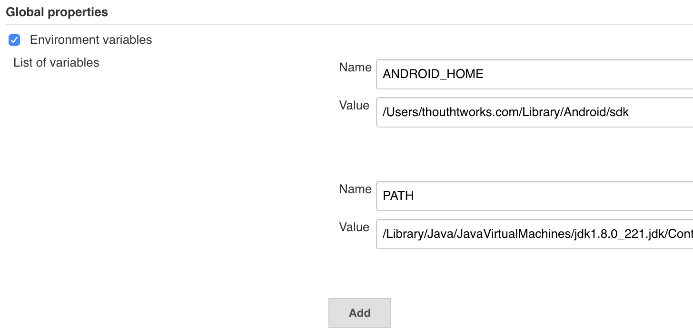

# Jenkins持续集成

### 安装jenkins

```shell
brew install jenkins
```

查询信息 `brew info jenkins`，可以得到如下输出：

```shell
jenkins: stable 2.200, HEAD
Extendable open source continuous integration server
https://jenkins.io/
/usr/local/Cellar/jenkins/2.200 (7 files, 63.9MB) *
  Built from source on 2019-10-20 at 09:15:32
From: https://github.com/Homebrew/homebrew-core/blob/master/Formula/jenkins.rb
==> Requirements
Required: java = 1.8 ✔
==> Options
--HEAD
	Install HEAD version
==> Caveats
Note: When using launchctl the port will be 8080.

To have launchd start jenkins now and restart at login:
  brew services start jenkins
Or, if you don't want/need a background service you can just run:
  jenkins
```

安装目录：`/usr/local/Cellar`

下载目录：`~/Library/Caches/Homebrew/`


### 启动jenkins

```shell
brew services start jenkins
```


### 停止jenkins

```shell
brew services stop jenkins
```


### Build Triggers

- **Build periodically** : 定时 build，在日程表里设置 build 时间，如设置 00 20 * * * 表示每天 20 点执行定时 build。
- **Poll SCM** : 轮询源码管理，表示在指定的时间点去轮询 Git 仓库，看是否有新的 commit，如有，则触发构建。如设置 0/5 * * * * 表示每5分钟轮询一次。

完成此步骤后，剩余的工作，皆可通过 Execute shell 脚本来执行。不同类型项目执行脚本不同。


### Pipeline

创建一个流水线配置的项目，通过pipeline脚本配置，可通过页面上的 [Pipeline Syntax](http://localhost:8080/me/my-views/view/all/job/android_sbux_pipeline/pipeline-syntax) 进入示例页面获取相应的命令。

```shell
node {
    stage('Preparation') {
        checkout([
            $class: 'GitSCM',
            branches: [[name: '${BRANCH}']], 
            doGenerateSubmoduleConfigurations: false,
            extensions: [], 
            submoduleCfg: [],
            userRemoteConfigs:
                [[credentialsId: 'dad8561d-9352-4086-935a-df8090836004', url: 'https://github.com/a284628487/Personal.git']]
            ])
    }
    stage('Build') {
        sh label: '', script: './gradlew assembleRelease'
    }
    stage('Analyze') {
        sh label: '', script: 'du -ah gradle-build/app/outputs/apk/release/* | grep "\\.apk"'
    }
}
```

参考: [Jenkins流水线配置](https://www.cnblogs.com/cash-su/p/10173518.html)


### 安装插件

登录 http://localhost:8080 ，选择“系统管理”——“管理插件”,在“可选插件”中选中“GitLab Plugin”、“Gitlab Hook Plugin”、“Xcode integration"等常用插件，然后安装。

安装完成插件后，就可以新建项目了!

其他常用插件有：

**Email Extension Plugin** 该插件用于替换 Jenkins 自带的邮件发送，更加的强大。

**Git Plugin** 该插件允许使用GIT作为一个构建SCM(源代码控制管理系统)。

**Post build task** 该插件允许用户依据构建日志的输出执行一个shell/批处理任务。

**Ruby Plugin** 该插件允许用户在构建脚本中使用 Ruby。

**Python Plugin** 添加执行 Python 脚本作为Hudson的构建步骤。

**Gradle Plugin** 该插件允许Hudson调用Gradle构建脚本作为主体构建的步骤。

**FTP-Publisher Plugin** 该插件能上传项目构件和整个目录到一个FTP服务器。

**Extended Choice Parameter plugin** 该插件可以扩展参数化构建过程

**Extended Choice Parameter Plug-In** 该插件可以扩展参数化构建过程

**Dynamic Extended Choice Parameter Plug-In** 该插件可以扩展参数化构建过程

**git parameter Plug-in** 该插件可以扩展参数化构建过程


### 环境配置

Manage Jenkins -> Configure System



指定PATH路径：`/Library/Java/JavaVirtualMachines/jdk1.8.0_221.jdk/Contents/Home/bin:/usr/local/bin:/usr/bin:/bin:/usr/sbin:/sbin`


#### 参考链接

- [jenkins 自动化打包配置](https://www.jianshu.com/p/3154a25b81d0)

- [Jenkins 持续集成](https://zhuanlan.zhihu.com/p/33727806)